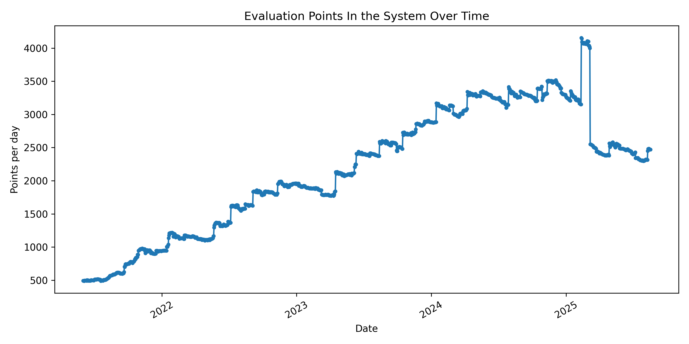
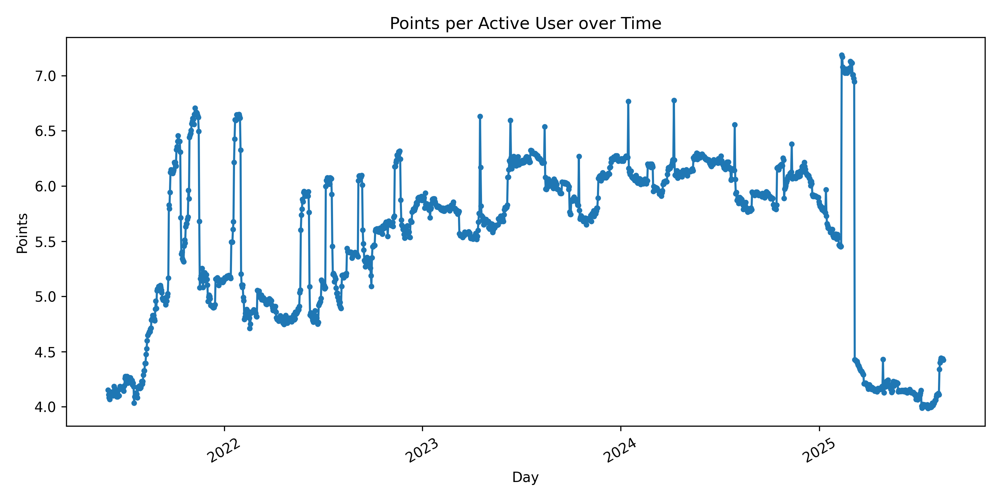
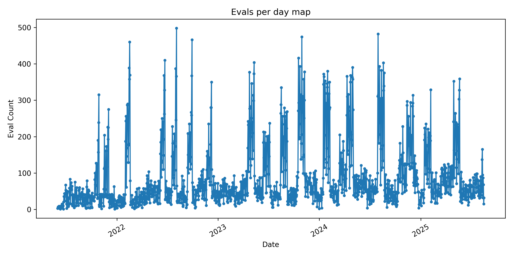

Repo analysis 42 evaluation point exchange over time!

Total Points in The 42 Heilbronn Eco System

Points held by active users and points held by non active users

Points held by active users and points held by non active users

Active user is who still does projects at 42 and is not allumnied, or blackholed
Student activity is meassured since piscine till alumation.

This data includes every project starting C-Pisciene Common Core and Outter Core, but includes only people who bassed the Piscine

This data includes every project starting C-Pisciene Common Core and Outter Core, but includes only people who bassed the Piscine

Active user is who still does projects at 42 and is not allumnied, or blackholed
