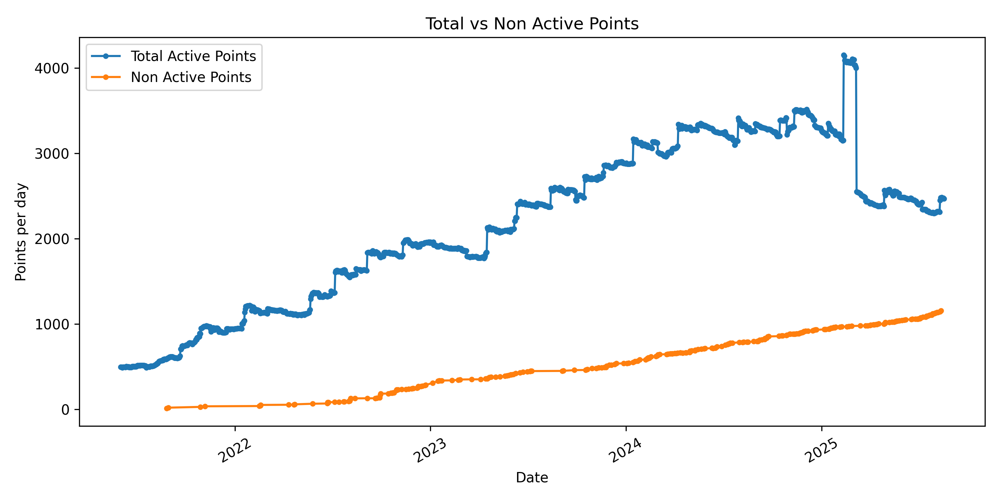
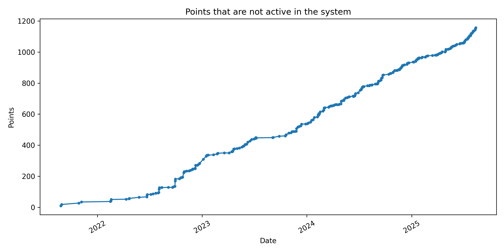

Repo analysis 42 evaluation point exchange over time!


How to run:
```
make
```


Total Points in The 42 Heilbronn Eco System


Points held by active users and points held by non active users





Active user is who still does projects at 42 and is not allumnied, or blackholed
Student activity is meassured since piscine till alumation.


This data includes every project starting C-Pisciene Common Core and Outter Core, but includes only people who bassed the Piscine


1 project == 6 evals, unless CPP modules where 1 project == 4 evals


1 project == 6 evals


1 project == 6 evals


1 project == 6 evals